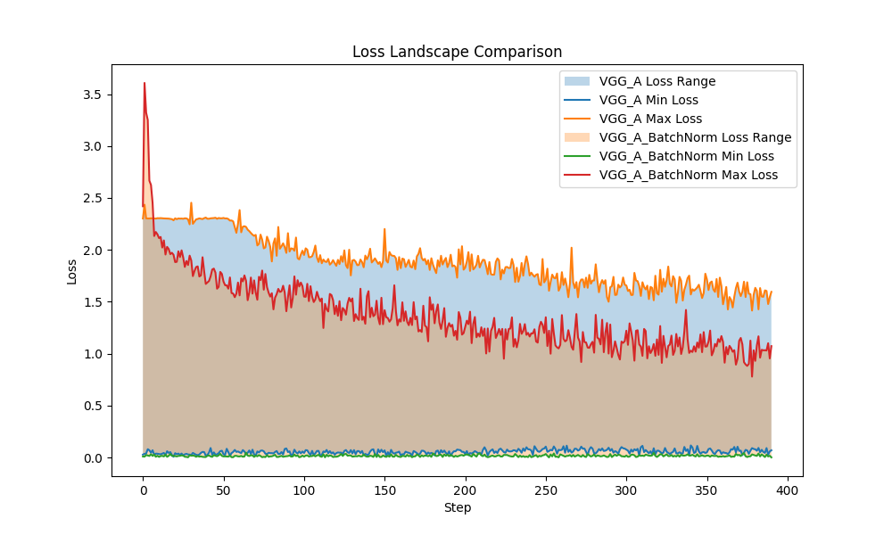

github:https://github.com/YuehuGong/VGG_BatchNorm
## 1. train a network on cifar10

### 1.1. get started
2. implemented by vgg_a(a,b,c,d)
3. I tried batch-norm layer(a), dropout(b), residual connections(c)
4. I tried vgg_light(a),L2-regularization(b),leaky-Relu(c)
5. I tried sgd(a,b)
6. I use VGG + BarchNorm + Dropout + Residual at last.
- VGG: A deep convolutional neural network known for its simple and uniform architecture. It stacks small (3×3) convolutional kernels in depth to extract hierarchical features effectively. VGG serves as the strong backbone for feature extraction in image classification tasks.
- BatchNorm: Batch Normalization stabilizes and accelerates training by normalizing the input of each layer. It reduces internal covariate shift, allows for higher learning rates, and improves convergence. It also has a slight regularizing effect.
- Dropout: Dropout randomly deactivates neurons during training to prevent overfitting. This encourages the network to learn more robust features that generalize better on unseen data.
- Residual (Res): Inspired by ResNet, residual connections allow gradients to flow directly through skip connections, alleviating the vanishing gradient problem in deep networks. This makes deeper models easier to train and leads to improved performance.
  
By combining these techniques, my model achieves better generalization, faster convergence, and improved accuracy compared to the vanilla VGG architecture.

| Model Variant                   | Description                      | Accuracy (%) |
|--------------------------------|----------------------------------|--------------|
| **Loss Function Comparison**   |                                  |              |
| VGG_A + L2                     | L2 loss                          | 74.98%       |
|                                |                                  |              |
| **Network Structure Comparison**|                                  |              |
| VGG_A                          | Baseline                         | 75.77%       |
| VGG_BatchNorm                  | With Batch Normalization         | 80.43%       |
| VGG_Dropout_BN                | BatchNorm + Dropout              | 81.66%       |
| VGG_Light                      | Lighter version (simplified)     | 68.71%       |
| VGG_Dropout_BN_Res             | Dropout + BN + Residual          | 81.96%       |
| VGG_A_LeakyReLU                | LeakyReLU activation             | **82.16%**       |
|                                |                                  |              |
| **Optimizer Comparison**       |                                  |              |
| VGG_BatchNorm + SGD            | SGD optimizer                    | 75.53%       |

- /
- /

## 2. batch normalization
From the comparison of loss landscapes of VGG-A with and without Batch Normalization, we can observe that:

Smoother Landscape: The loss surface of the BN-enabled model is much smoother and has a more well-defined, convex-like basin compared to the one without BN. This indicates a more stable and easier optimization path during training.

Fewer Sharp Minima: Without BN, the surface has more sharp, chaotic valleys, which may lead the optimizer to get stuck in poor local minima or suffer from unstable gradients.

Better Generalization: The smoother, flatter minima seen in the BN version are associated with better generalization performance on the test set, which aligns with our observed accuracy increase(75%-80%).

